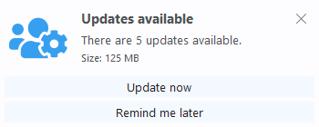
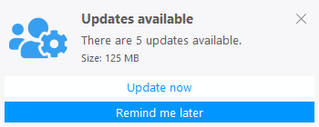
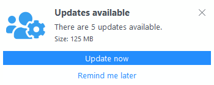

# Toaster

This is a library for showing toast notifications in Java applications.

Toasts can have a title, a message, a details description and an icon.
They can be sticky, so the user have to close them manually, and they can have some further actions that can be executed by the user on clicking a corresponding button.


## Usage

Here is a sample showing the basic usage.

```java
import io.github.dogla.toaster.Toast;
import io.github.dogla.toaster.ToastAction;

@SuppressWarnings({ "nls", "javadoc" })
public class ToasterMain {
	
	private static final String IMG_DEMO = "iVBORw0KGgoAAAANSUhEUgAAAEAAAABACAYAAACqaXHeAAAGU0lEQVR4nO1aaYgcRRRe7/tCEI94InhE4zHOdM+a4OIPLxRvxQuN6C+DiqIiiC6iRrwNiqzZqe6ZJBpXxChRZFV0PaMBL4gm4rGYmOxmt6tqNjHrsbvje31tb0939T0j0g8es9s99eq9r17VO2o6OnLKKaeccsopp5xyah119rLDZYV1yYRfKRF2oUzqkrRU27vdemVKhR66DxjdLRH+vaSwhgf/LansXVnlV3Q0Gtu1W99UqUTY9WDgqI/hTQxAfSkR7fh2652cYCUlhT4W1nAX18uKdk67TUhEksofiWm8xX+VFDqv3XbEIjD+0oTGG6yykSLRDm23PZHo3EWNXUD531IBALiksKUtN0Kq0jkQoqqwAuvRFSWFb4K/Xw3jkiVCF6RlvMlTRVWb3Qq7DQMUfhdMOilQ6OmO7sb2fuPh/UcpA4Be8EBLjJdVdmsopQh7wmv86ZWRveD9RNoAQDRZlbnxhRo9DJD+M6xSmMG5ZWD8Tt94nYczBwAmeTCKUpCwqG4ZmOJmBMCkaNulAwCkohGVWtcMoiZnBMBEpsYj6SloQrcs1fiRGQEwmDkAcLC9EVGpb9wyLu9r7CBFyPsjbLc+a46TFbYvPLtRUunjGKrxHXgvKRH+EFaYhZ7GTrEAiBy/fSIBKLMkocGQd7CvIff4AT6n8BnkH1fbeqr8buF4lZ8VC4Cu5zfvqSc84ZTcJi3WZnkCUKFzE6x079xlfD9LVrm3fjQ8fw6zS+uZTNh9IhmwkOfHAkCfkLAzzBUQKToFk1wlkgPh9M2oxoPMV8LomCkAhvJ0npkCe02gwSpdEiSjXB09BL77e2jjFfaTsys0u6+xc1d3Y8cm3SrsJPj+QIC8mpd3Fno27h4ahHLf+t3woMFCBD77IRNbjmcEHkBhZRSVehHGjgUCoLJ/4PA61TayOrY/PP8R+JdSlV1syNp8IPz/emiPAplwRj2LduChaKb3W/XCqpUdp7JCT4SJB4NWzB6gN1HY+673A1gWxztX6NqmNpzK7m8ZAEi4ooD8Ign7fs1KTpaV0WOt70JouyWeoREYvAO9s6UgIGGtAefHHcDvGV7Bx4Fftt6bhVTqOYQPf9KkIMZPeLECeFgy468Po5L9aXdwYWXubJHxOmPdYqwMHBLwoBJT0Eo8aFIBQGHfRZx7I7BiNF7pcvibRxoPWaQ1cVzjhzD1TMN4Qw/6Yvi5+UJncoSECRR2rUKNxyihsNstt49hPF0Fe/ZgpwLoCXDYXYTZHEywWs8lVLYFlP1cIvRa3OOBIBj6rBPNDXM86Tder0UCq1r6jn3vECdjgwk+xrTZOams8Jul4MQHo8AAxmf4vA0+5wNYN7ivxQpLRg4SyKjPqQ3tIQLRDL1+4791IR45vv7sTIbMyqw/5haylYKVL9g6YUPW3/XfCvIiXYZxPnjJ2OD+oui0d/OEU9HO2pYDgtw1PPOF0zoJmioqfykcAHol6SWDugGIougz1jij9w97O6Hh2IPUw6mDioQf5T8muDlqRrWtPuPXxgSAj+OKT4+Lfec3gyGK3NS8euw6wZhJuTZ6nAgA/drd345N6GHTkxnhIFhZlREb4YjdYwHXnRUfpsRScx3gpctqv4hituSGAmRMYdMGCyy8uv4qjLLOm1oolx9NY/WxBHat/IYI49egThiBdPCM6hU9ZziCjBVW3BVfZICXdCm/7upQdE0aAKBc50rCs9diyNkmGeHXq9ASM6H36hPrdTu4ODz8AFblQzfbKWOHHfaSG28y5gG2Z5H62WnKFjMfx3xDdJZ4Eh5AKSszMGMbEP5ZKwCQVfZUZOP1VcJ2WcrKOG+cy1V2SuiDOT4PhknLvT0gg6sv2GafOstqSKvvcbwfwjQbeFlk2QCkfleAP87Sew9G3lEmWmcs47MCQFeM0AUz5+EPY3boXClZoRfAd78IIQ+z25XOrNVMrmpYrMU2HilJzz+A/3A2RoU64I2QQJas0msSGSmcfLE2K7O9CeUzeNgR7jnddX/m9wKBIAT35ZOwhl1b2LtnYksctsIL6B2Qep/3nwHATFm1DEFoZsLm2wtA+GXWoebBFPsBmQKgg4B3doS/LYl/S5QmAFXn/JgCow54oqO3YIHTlp/TYTcHPeK0XnpCplwZO6blxuWUU0455ZRTTjn9n+lf/xj/FRgWU1wAAAAASUVORK5CYII=";

	public static void main(String[] args) throws InterruptedException {
		Toast.builder()
			.title("Updates available")
			.message("There are 5 updates available.")
			.details("Size: 125 MB")
			.icon(IMG_DEMO)
			.sticky(true)
			.action(ToastAction.builder()
						.text("Update now")
						.executable(t -> System.err.println("Update started..."))
						.build())
			.action(ToastAction.builder()
						.text("Remind me later")
						.executable(t -> System.err.println("Remind me later."))
						.build())
			.build()
			.toast();
		
		// keep the program alive for 10 seconds
		Thread.sleep(10000);
	}
}
```

The corresponding toast will look like this:


For simplicity, the sample uses an image as base64 encoded string.
Besides base64 encoded strings, icons can also be
- an instance of `org.eclipse.swt.graphics.Image`
- an instance of `org.eclipse.jface.resource.ImageDescriptor`

# Configuration

The sample above shows only the default theme without any further configuration.

You can customize the appearance with the following settings:

| Settings | Description |
| --- | --- |
| position | the position of the toast: TOP_LEFT, TOP_RIGHT, BOTTOM_LEFT, BOTTOM_RIGHT |
| minWidth, minHeight, maxWidth, maxHeight | with these settings you can customize the size of the displayed toast |
| minIconWidth, minIconHeight, maxIconWidth, maxIconHeight | with these settings you can customize the size of the displayed icon |
| allowIconUpscaling | flag indicating if the icon should be upscaled if it is smaller than the configured icon size |
| backgroundColor | the color for the background of the toast |
| iconBackgroundColor | the color for the background of the icon |
| borderColor | the color for the border of the toast |
| titleForegroundColor | the color for the foreground/font of the title |
| messageForegroundColor | the color for the foreground/font of the message |
| detailsForegroundColor | the color for the foreground/font of the details text |
| actionsBackgroundColor | the color for the background of an action button |
| actionsForegroundColor | the color for the foreground/font of an action button |
| actionsBackgroundColorHovered | the color for the background of an action button when the mouse hovers over it |
| actionsForegroundColorHovered | the color for the foreground/font of an action button when the mouse hovers over it  |
| transparency | the transparency of the whole toast |
| displayTime | the time how long the toast should be shown (if not sticky) |
| fadeInTime | the time for the fade in animation |
| fadeOutTime | the time for the fade out animation |
| fadeInSteps | the animation steps used for the fade in animation |
| fadeOutSteps | the animation steps used for the fade out animation |

All settings are available inside the `ToastBuilder`, e.g. `Toast.builder().backgroundColor(color)`.

Furthermore the actions have also some customizable settings.:
| Settings | Description |
| --- | --- |
| backgroundColor | the color for the background of the action button (overrides `ToastBuilder.actionsBackgroundColor` |) |
| foregroundColor | the color for the foreground/font of the action button (overrides `ToastBuilder.actionsForegroundColor` |) |
| backgroundColorHovered | the color for the background of the action button when the mouse hovers over it (overrides `ToastBuilder.actionsBackgroundColorHovered` |) |
| foregroundColorHovered | the color for the foreground/font of the action button when the mouse hovers over it (overrides `ToastBuilder.actionsForegroundColorHovered` |) |
| transparency | the transparency of the whole toast |

All settings are available inside the `ToastActionBuilder`, e.g. `ToastAction.builder().backgroundColor(color)`.

# Samples









